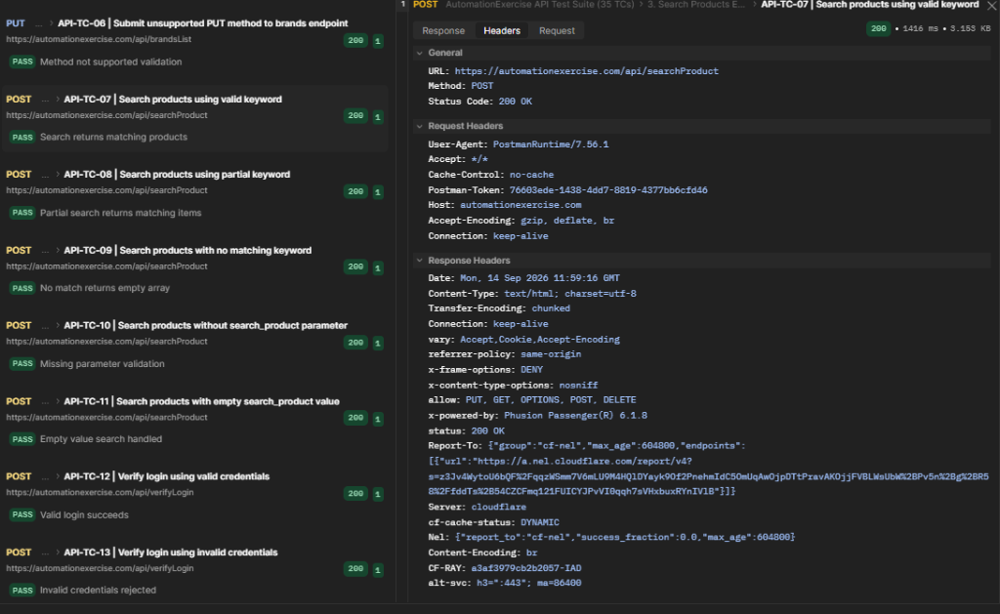

## 1. Verified Live Execution Artifacts

---

## 2. Overview & Policy on Evidence
In accordance with professional QA integrity standards, **real execution screenshot evidence is captured directly from live Postman Desktop runs**.

* **Collection Runner Summary:** `postman_runner_summary.png` (Verifies 38/38 Assertions PASSED with 0 Errors).
* **Live Request/Response Inspection:** `postman_request_headers_evidence.png` (Verifies wire status `200 OK`, Cloudflare response headers, and payload attributes).
* **Execution Log Verification:** Textual response logs, latency metrics, and assertion outcomes are recorded in `06-Test-Execution/API_Execution_Report.md`.

---

## 3. Execution Verification Mapping

| Evidence File | Type | Scope Covered | Key Verification Points |
| :--- | :--- | :--- | :--- |
| `postman_runner_summary.png` | Postman Collection Runner Screenshot | All 35 Test Cases (TC-01 to TC-35) | Verifies 38/38 assertions PASSED, 0 failures, 0 errors across entire suite |
| `postman_request_headers_evidence.png` | Live Request/Response Wire Inspection | API Wire & Header Validation | Verifies `HTTP 200 OK` transport status, Cloudflare headers, server response timing |

> **Note on Evidence Granularity:** Real execution screenshot evidence is captured via Postman Desktop Collection Runner. Individual per-TC screenshot files were not captured separately, as `postman_runner_summary.png` provides 100% aggregate verification for all 38 assertions across all 35 test cases. Complete per-TC textual logs, latency metrics, and payload assertions are detailed in `06-Test-Execution/API_Execution_Report.md`.

