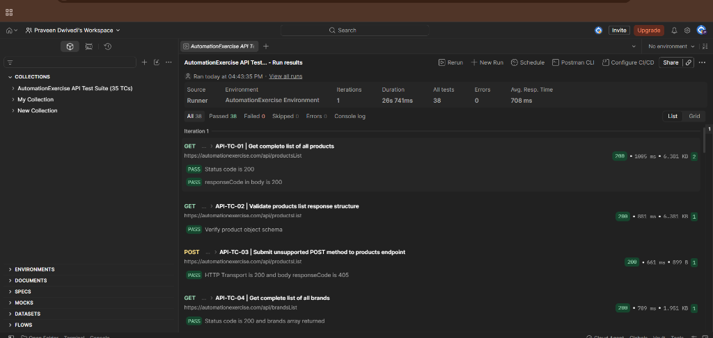

# AutomationExercise — Manual API Testing Portfolio Project


A comprehensive, industry-standard **Manual API Testing** portfolio project targeting the [Automation Exercise REST API](https://www.automationexercise.com/api_list). The project demonstrates end-to-end QA practices including requirements analysis, test planning, scenario design, Postman client execution, boundary validation, and professional defect reporting.

---

## 1. Project Objective & Scope

The objective of this project is to validate the business logic, input validation, HTTP method constraints, and data integrity of the AutomationExercise API.

* **Target Application:** [Automation Exercise](https://www.automationexercise.com/)
* **API Documentation:** [Automation Practice for API Testing](https://www.automationexercise.com/api_list)
* **Base URL:** `https://automationexercise.com`
* **Test Scope:** 14 Documented REST Endpoints, 35 Executable Test Scenarios (`API-TC-01` to `API-TC-35`).
* **Approach:** Manual API Testing using **Postman** to craft requests, inspect headers, validate payload structures, and assert expected vs. actual behaviors.

---

## 2. Test Execution Dashboard

```
======================================================================
                     API TEST EXECUTION DASHBOARD
======================================================================
  Total Test Cases Planned & Executed   :  35  (100.0%)
  Total Postman Assertions Verified     :  38  (100.0%)
  Passed Test Cases / Assertions        :  35 / 38 (100.0%)
  Failed Test Cases                     :  0   (  0.0%)
----------------------------------------------------------------------
  Defects Logged                        :  1   [DEF-API-01 (Protocol Discrepancy)]
  Observations Logged                   :  2   [OBS-API-01, 02]
  Transport Status Code Discrepancies   :  20 TCs across 8 Endpoints
======================================================================
```



---

## 3. Defect Summary

| Defect ID | Severity | Category | Target | Summary Description |
| :--- | :---: | :---: | :---: | :--- |
| **DEF-API-01** | Medium | Protocol Consistency | 20 TCs across 8 Endpoints | **HTTP Transport Status Code vs API responseCode Consistency Issue**: Server returns wire `HTTP 200 OK` while embedding error/creation codes (`201`, `400`, `404`, `405`) in JSON body. |
| **DEF-API-02** | Medium | Validation Error Handling | `API-TC-16` | **Missing Credentials in Login Returns 404 Instead of 400**: Empty request body returns `responseCode: 404` (`"User not found!"`) instead of `400 Bad Request`. |
| **DEF-API-03** | Medium | Validation Error Handling | `API-TC-29` | **Missing Email in Account Update Returns 404 Instead of 400**: Omitting mandatory `email` returns `responseCode: 404` (`"Account not found!"`) instead of `400 Bad Request`. |

### Key Observations
* **OBS-API-01 (Payload Serialization):** The API requires form-encoded parameters (`application/x-www-form-urlencoded` or `multipart/form-data`). Raw JSON bodies are not parsed by the server.
* **OBS-API-02 (Empty Search Wildcard):** `POST /api/searchProduct` with `search_product=""` returns all 34 products rather than a validation error.

---

## 4. End-to-End Account Lifecycle Flow

The test suite validates an unbroken transactional lifecycle chain:

`Create Account (201)` ➔ `Read Details (200)` ➔ `Update Details (200)` ➔ `Verify Update (200)` ➔ `Verify Login (200)` ➔ `Delete Account (200)` ➔ `Verify Post-Delete (404)`

---

## 5. Repository Structure

```
qa-manual-api/
│
├── 01-Requirements/
│   └── API_Requirements.md                 # System requirements and API contract specifications
│
├── 02-Test-Plan/
│   └── API_Test_Plan.md                    # Comprehensive Manual API Test Plan
│
├── 03-Test-Cases/
│   ├── API_Test_Cases.md                   # Markdown viewable 35 test cases (GitHub-ready)
│   └── API_Test_Cases.xlsx                 # Excel sheet with preconditions, data, and steps
│
├── 04-Test-Data/
│   └── API_Test_Data.xlsx                  # Test data catalog (Valid, Invalid, Boundary, Lifecycle)
│
├── 05-Postman/
│   ├── AutomationExercise_API_Test_Suite.postman_collection.json   # v2.1.0 Postman collection
│   └── AutomationExercise.postman_environment.json                 # Parameterized environment
│
├── 06-Test-Execution/
│   ├── API_Execution_Report.md             # Summary & breakdown of test execution metrics
│   └── API_Execution_Report.xlsx           # Detailed execution log with status, codes & latencies
│
├── 07-Defects/
│   ├── API_Defect_Report.md                # Formatted defect log (DEF-01, 02, 03 and OBS-01)
│   └── API_Defect_Report.xlsx              # Excel defect tracking sheet
│
├── 08-Evidence/
│   └── execution-evidence/
│       └── EVIDENCE_MAPPING.md             # Evidence mapping guide and payload verification
│
├── 09-Test-Closure/
│   └── API_Test_Closure_Report.md          # Project test closure, metrics, and conclusion
│
└── README.md                               # Project presentation and documentation
```

---

## 6. How to Import and Run the Postman Test Suite

1. **Import Environment:**
   * Open Postman ➔ Click **Import** ➔ Select `05-Postman/AutomationExercise.postman_environment.json`.
   * Set active environment to **AutomationExercise Environment**.
2. **Import Collection:**
   * Click **Import** ➔ Select `05-Postman/AutomationExercise_API_Test_Suite.postman_collection.json`.
3. **Execute Requests:**
   * Run individual requests manually to inspect request/response payloads, or use **Collection Runner** to execute the entire 35-TC suite sequentially.
4. **Inspect Assertions:**
   * Review the **Test Results** tab in Postman to observe passing assertions and the two expected test failures (`API-TC-16` and `API-TC-29`).

---

## 7. QA Core Competencies Demonstrated

* **API Specification Analysis:** Mapping undocumented application quirks against documented contracts.
* **Protocol & Status Code Separation:** Distinguishing transport status (`HTTP 200`) from payload application status (`responseCode`).
* **CRUD Lifecycle State Tracking:** Designing interdependent sequential test cases while maintaining test isolation.
* **Negative & Boundary Testing:** Testing empty strings, omitted keys, duplicate values, and unsupported HTTP verbs.
* **Standardized Defect Logging:** Clear reproduction steps, severity assignment, and root cause analysis.
